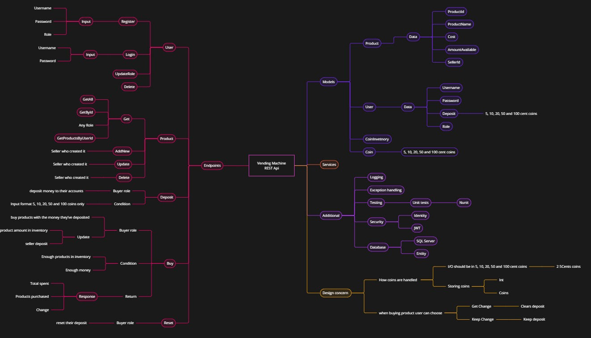
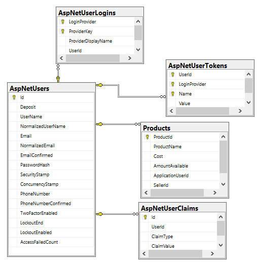

# Vending machine REST api 🏧➡️🍬

Short description here

## Quick start

Link here if deployed on a external service

## Table of Contents

-   [Introduction](#introduction)
-   [Technologies](#technologies)
-   [Project walkthrough](#project-walkthrough)
-   [Features](#features)
    -   [Future features](#future-features)
-   [Getting Started](#getting-started)
    -   [Prerequisites](#prerequisites)
    -   [Installation](#installation)

## Introduction

This project is a vending machine rest api done as a FlapKap’s Backend challenge to create REST api

-   I created a REST api with access to database (ef core), JWT security (Identity), Logging (Serilog)
-   Testing (Nunit, Moq, sqlite in memory) methodology
    -   Tested products service ensuring correct logic and exception handling
    -   Tested user controller endpoints for correct routes response
    -   Todo: Test products controller for correct endpoints routes responses

## Technologies

<a href="https://skillicons.dev">

</a>

Additional used

-   Nunit
-   Serilog
-   Entity framework
-   Sql server
-   Identity

## Project walkthrough

### Outline [🔼](#table-of-contents)

For better quality check the file ["Outline.jpg"](Outline.jpg)


### Database schema [🔼](#table-of-contents)

For better quality check the file ["Schema.jpg"](Schema.png)


## Features [🔼](#table-of-contents)

Highlight the key features of the project

-   CRUD for users
    -   Login\Register using jwt bearer token
-   CRUD for product
-   Buy products
-   Deposit
-   Reset

## Getting Started [🔼](#table-of-contents)

### Prerequisites [🔼](#table-of-contents)

    -   Git
    -   DotNet 8
    -   SqlServer

### Postman [🔼](#table-of-contents)

I have created a Postman collection with available endpoints. You can use it as a reference on how to use the API. Find the documentation [here](https://documenter.getpostman.com/view/29637594/2s9Yyy9ea4).

### Installation [🔼](#table-of-contents)

Steps to install and run this project locally

-   Step 1 clone project in terminal paste:
    ```bash
    git clone github.com/ahmads1990/VendingMachineApi
    ```
-   Step 2

    -   Using(SQL SERVER main branch) change the Connection String to match your local sql server

        ```json
        {
        	"ConnectionStrings": {
        		"DefaultConnection": "Your connection string"
        	}
        }
        ```
